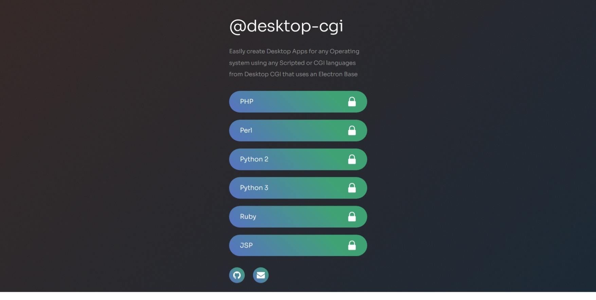

# desktop-cgi
Desktop-CGI is a desktop executable app that can be created from any CGI files or CGI web apps that can be served from an file, an embedded web server using proxy, or an remote proxy web server. It supports all major Operating systems like Windows, Linux, and MacOS.

# Highlights

Desktop-CGI can serve any CGI files or CGI / Scripted / Interpreted languages like PHP, Ruby, Python, Perl, JSP, ASPX, Other Interpreted Languages through embedded webservers or any remote proxy webserver apps 

Desktop-CGI runs an Electron - Node - Express based application under the hood and supports major Operating systems like Windows, Linux, Mac or any operating systems supported by Electron.

# Usage

* Install node.js from [https://www.nodejs.com](https://www.nodejs.com)
* Clone the Git repository (Alternatively, download the git repository)
* `cd path/to/desktop-cgi-folder` (change directory) into the git repository folder from command line / shell / powershell
* Run command `npm install`
* Install electron packager
    - [electron-packager](https://github.com/electron/electron-packager): `npm install -g electron-packager`
* Add your application in the respective `www` folder
* Check and modify `config.json` file for your application's configuration needs
* Check if your electron app runs using command `npm run electron`
* Run command `npm run electronbuild`

# Functionality Details

##### Electron based Desktop application that runs CGI Server

* Run any script files that supports CGI based file script serving - using `cgijs` file module
* Run any host that serves a web app - using `cgijs` proxy 
    - In App / Local / Remote proxy support
* Allows embedding servers like httpd, nginx, etc to serve web applications - using `cgijs` process module
* Allows
    - running multiple interpreters in one app
    - running multiple proxies in one app
    - multiple embedded servers in one app
* Allows 
* `cgijs` is Nodejs framework independent / agnostic for serving CGI or interpreted scripting apps via files, or server based web apps via proxies
    - Express Recommended and used for demo

##### The script will pipe all interpreted language files below:

* Python (2.x, 3.x)
* Perl (Version Independent)
* PHP (Version Independent)
* Ruby (Version Independent)
<!-- * JSP (Version Independent) -->

##### The script will pipe all proxies of above languages and following:

* Jsp (With Tomcat embedded)
* Aspx (Version Independent - With local IIS proxy, Apache embedded)
* Any app using local / remote proxy

##### The script should currently allow embedding following servers for proxy [TODO: In Development]:

* Apache HTTPD (Allows Embed & Proxy)
* Apache TomCat (Allows Embed & Proxy)
* Nginx (Allows Embed & Proxy)
* Mongoose (Allows Embed & Proxy)

The script can proxy to any File or most embeddable servers or Proxy-able local/remote servers; even IIS (Allows Proxy)

##### Note:

##### Package Dependencies:

* Library dependencies:
    - Nodejs: (> 8.x)

* Application Dependencies:
    - cgi-js: (>=1.0.0)

##### Usage Demo:

Check `index.js` and `server` folder for demo code

# Technical Specifications

...  * Wiki link to be added

# Wiki

# Status

    In development

# Todo

Check file - [.todo](./.todo)

# References

##### Other Packing Solutions you can use

- References: [Electron Application Distrubution](https://www.electronjs.org/docs/tutorial/application-distribution)
- [electron-forge](https://github.com/electron-userland/electron-forge): `npm install -g @electron-forge/cli`
- [electron-builder](https://github.com/electron-userland/electron-builder): `npm install -g electron-builder`

# License

The MIT License (MIT) - See [LICENSE](./LICENSE) for further details

Copyright © 2019 - till library works:
    Ganesh B <ganeshsurfs@gmail.com>

